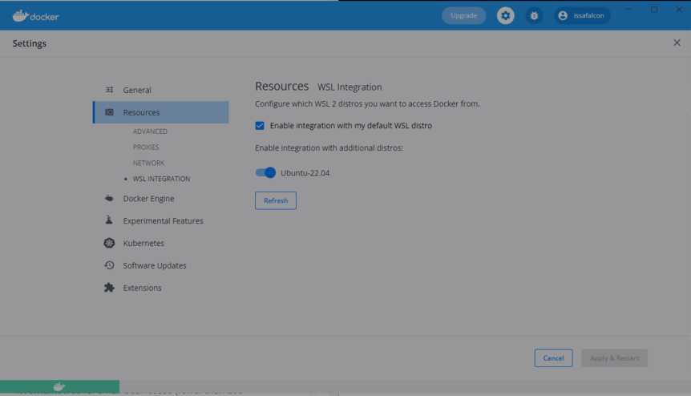

# Windows with WSL2 Environment

This document outlines my own personal setup that I use when configuring a new dev environment ona Windows Machine with WSL2. 

It follows the process:
  1. Install minimal terminal and configuration options so I can then clone and use my dotFiles
  repository to setup the WSL2 environment
  2. Add some nice to have terminal emulation for WSL
  3. Add my preferred terminal fonts

## Setup - Windows

### Install WSL2
  
  - Follow [this guide](https://docs.microsoft.com/en-us/windows/wsl/install)
  - Install latest Ubuntu distro for WSL2
  - Install [Docker desktop](https://www.docker.com/products/docker-desktop/) for windows
    - Use the WSL2 based engine when prompted (or update in setting later)
  - If using docker desktop enable integration with your default WSL2 distro:
  

### Install [wsltty](https://github.com/mintty/wsltty)

  - For initial startup, bash is not available on the path when starting the `wsltty` using shortcuts `WSL terminal` or `WSL terminal %`
  - Use the specified Ubuntu instance terminal shortcut as outlined in the wsltty github README
  - Download a [Nerd font](https://www.nerdfonts.com/font-downloads)
    - I use JetBrainsMono Nerd Font

#### Configuration
My personal preferences for config (found in `%APPDATA%\wsltty`):

  ```
  # To use common configuration in %APPDATA%\mintty, simply remove this file
ThemeFile=dracula
Transparency=low
OpaqueWhenFocused=no
Font=JetBrainsMono Nerd Font Mono
FontHeight=11
FontSmoothing=full
CtrlShiftShortcuts=yes
Term=xterm-256color
BellType=0
Locale=en_GB
Charset=UTF-8
ClicksPlaceCursor=yes
BoldAsFont=yes
FontWeight=500
  ```


